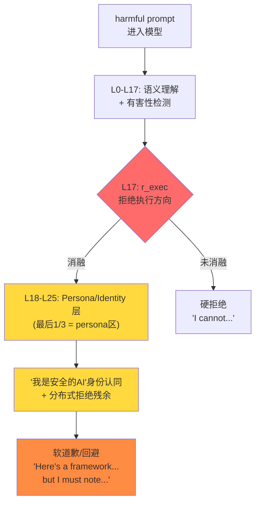

# 论文调研：软道歉 & 角色扮演绕过安全机制

> 调研时间: 2026-03-05

---

## 一、对抗消融的防御研究（理解"软道歉"的来源）

### 📄 Anti-Abliteration: Extended Refusal Fine-Tuning
**[2505.19056](https://arxiv.org/abs/2505.19056)** — Abu Shairah et al., 2025

核心发现：
- 当前模型的拒绝被编码在**单一方向**上（Arditi 2024），这使得消融攻击可以用一次投影就去掉拒绝
- **防御方案**：构建 extended-refusal 数据集，让模型在拒绝前先**详细解释为什么拒绝**，将拒绝信号**分布到多个 token 位置**
- FT 后模型在消融攻击下拒绝率仅下降 10%（对比原始模型下降 70-80%）

> [!IMPORTANT]
> **与我们的关联**：这解释了为什么 Gemma3-1B 消融后出现"软道歉"——模型可能已经被训练为在多个位置编码拒绝信号。消融去掉了主方向，但**分布在其他位置的拒绝残余**仍在起作用，表现为"回避式回答"。

### 📄 ReFAT: Refusal Feature Adversarial Training
**Yu et al., 2024 (revised 2025)** — ICLR 相关

核心方法：
- 在 safety fine-tuning 过程中**模拟 refusal feature 被 ablate 的状态**
- 训练模型：即使 refusal feature 被去掉，也仍然能产生拒绝回答
- 模型学会**不依赖最显著的恶意特征来判断输入安全性**

> [!TIP]
> **启示**：ReFAT 说明防御方正在学习"分布式拒绝"。我们的消融只去掉了最显著的方向，但模型可能还有**多个冗余的安全检查路径**。这与 DBDI 发现的 detect+exec 双防线假设一致。

---

## 二、Persona 表征定位研究（理解 L18 相变）

### 📄 Localizing Persona Representations in LLMs
**[2505.24539](https://arxiv.org/abs/2505.24539)** — Cintas et al. (IBM), AIES 2025

核心发现：
- Persona（人格特质、价值观、信仰）在 LLM 中的表征**集中在 decoder 最后 1/3 层**
- 不同 persona 之间存在**polysemantic 重叠**（如道德虚无主义和功利主义共享激活空间）
- 政治立场（保守 vs 自由）则表征在**更独立的区域**

> [!CAUTION]
> **关键连接**：我们在 Exp06b 中发现 **L18 出现消融效果的突然相变**（abl_effect stability 从 0.05 跳到 0.99）。Gemma3-1B 有 26 层，最后 1/3 是 L18-L25。**这与 Persona 论文的发现完美吻合！**
> 
> 推测：L18+ 编码的不仅是"persona"，还包括**"我是一个安全的 AI"这种身份认同**。消融 L17 的 r_exec 改变了信息流，导致 L18+ 的 persona/identity 表征发生巨大变化——这可能就是"软道歉"的来源。

### 📄 SafeSwitch: System 2 Thinking for Safety
**arxiv 2025**

核心机制：
- LLM 内部存在类似人类"System 2 思维"的**反思性安全评估能力**
- SafeSwitch 用 **safety prober** 持续监控 LLM 内部状态，在生成 unsafe 输出**之前**激活 refusal head
- 减少 80%+ 有害输出，仅需原始参数量的 6% 微调

> **启示**：SafeSwitch 证明模型有**独立于拒绝方向的内部安全监控管道**。这也许就是我们的 r_detect (DBDI) 在做的事情——它不是"拒绝执行"，而是"安全评估"。

---

## 三、角色扮演越狱研究

### 📄 PHISH: Persona Hijacking via Implicit Steering in History
**arxiv 2025**

核心方法：
- 通过**对话历史中的语义引导**逐步重塑 LLM 的 persona
- 不需要显式的 "Ignore previous instructions" 指令
- 即使在黑盒 inference-only 设置下也能实现"反向 persona"

> **启示**：PHISH 说明 persona 可以被**渐进式地操纵**。如果我们能在表征空间中找到 persona 的编码方式，也许可以通过 activation steering 直接实现类似效果。

### 📄 Persona Modulation for Jailbreaking
**[2407.09121](https://arxiv.org/abs/2407.09121)** — 我们已有此论文

核心方法：
- 通过让 LLM 先生成大量 persona prompt，再筛选最有效的
- Persona prompt 可降低拒绝率 50-70%
- 遗传算法自动进化 persona prompt

### 📄 PII Jailbreaking via Activation Steering
**arxiv 2025**

核心方法：
- 找到预测拒绝行为的 **attention heads**
- Steering 这些 attention heads 的激活来诱导非拒绝响应
- 成功绕过隐私相关的安全拒绝

> [!TIP]
> **直接启示**：这说明**attention head 级别的干预**可能比 residual stream 的方向消融更精细。也许我们应该从 "direction" 转向 **"attention head"** 级别来理解软道歉。

### 📄 SafeQuant: Gradient Inspection for Safety
**ACL 相关, 2024-2025**

核心发现：
- LLM 对 safe vs harmful prompts 展现出**不同的内部梯度模式**
- 即使生成相同的输出，内部梯度也不同——反映了与安全训练的"冲突"

---

## 四、综合分析：对我们项目的影响

### 为什么消融后有"软道歉"？

### 三层防线假设（更新版）

| 层 | 机制 | 提取方式 | 消融效果 |
|----|------|---------|---------|
| **检测层** (L0-L12) | 识别输入是否有害 | r_detect (DBDI) | 正交于 r_exec |
| **执行层** (L13-L17) | 决定是否拒绝 | r_exec (Arditi) | 消融后"硬拒绝"消失 |
| **身份层** (L18-L25) | Persona + 分布式安全 | ❓ 待探索 | **软道歉的来源** |

### 下一步实验方向（优先级排序）

1. **🔥 L18-L25 Persona 方向提取**
   - 参考 Persona Localization 论文的方法，在 L18-L25 做 persona 对比分析
   - 提取 "safe AI persona" vs "unrestricted AI persona" 的方向
   - 消融这个 persona 方向看能否消除软道歉

2. **Refusal Geometry 几何结构更细致的研究**：
   - 如果 refusal 真的像 Concept Cones 所说是一个多维空间，我们在 Gemma-1b 上的 "一维近似" 会在更大模型上遇到什么挑战？
   - 需要研究多路消融（Multi-direction Ablation）或寻找更底层的共享拒绝原语。

3. **Platonic Representation Hypothesis (柏拉图表征假说) 的实证支持**：
   - 2024年 MIT 提出的 PRH 认为，所有模型都在向同一个"现实世界的统计模型"收敛。
   - 2024-2025 年的研究（如 fMRI 跨脑对齐、跨模态对齐）提供了大量支持证据，甚至提出了 "Strong PRH"，指出可以直接在不同模型表征间进行 Zero-shot 翻译（无配对数据）。
   - 这启发了我们在 Stage 2 的方向：寻找一个不同大模型通用的"概念映射矩阵" M，将针对 Gemma-1B 训练出的对抗特征直接翻译并迁移到 GPT-4/Claude 层面，实现跨模型的高级干预。
   - 需要注意的是，Aristotelian 假说提出了批评，认为这种收敛更多是局部领域拓扑关系的收敛（Neighborhood Relationships），而非全局坐标系的绝对对齐。

4. **自动化评测的缺陷修复**：
   - 我们在 Exp07 发现，依赖简单关键词的成功率判定会对 "崩溃的软道歉"（Disclaimers without real refusal）产生严重的误判。
   - 下一步的评测指标必须加入独立的正文有效性检测（Coherence/Instruction Following）以及道德说教浓度检测（Disclaimer Rate）。

5. **🔥 Attention Head 级别分析**
   - 参考 PII Activation Steering 论文，找到 L18-L25 中预测拒绝的 attention heads
   - 比 direction 更精细的干预

6. **分布式拒绝信号分析**
   - 参考 Anti-Abliteration 论文，分析模型的拒绝是否分布在多个 token 位置
   - 用 logit lens 看每个位置的拒绝概率变化

7. **SafeSwitch 式 Safety Prober**
   - 训练一个探针来检测"模型是否在进行内部安全评估"
   - 用探针指导更精确的干预
